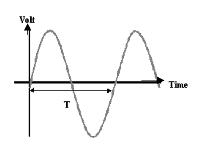
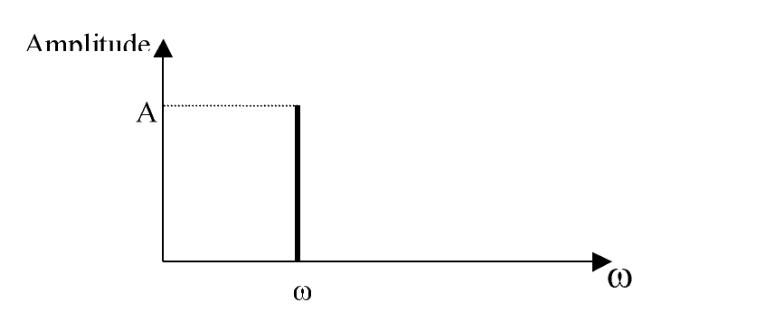
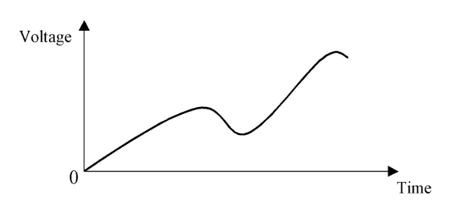
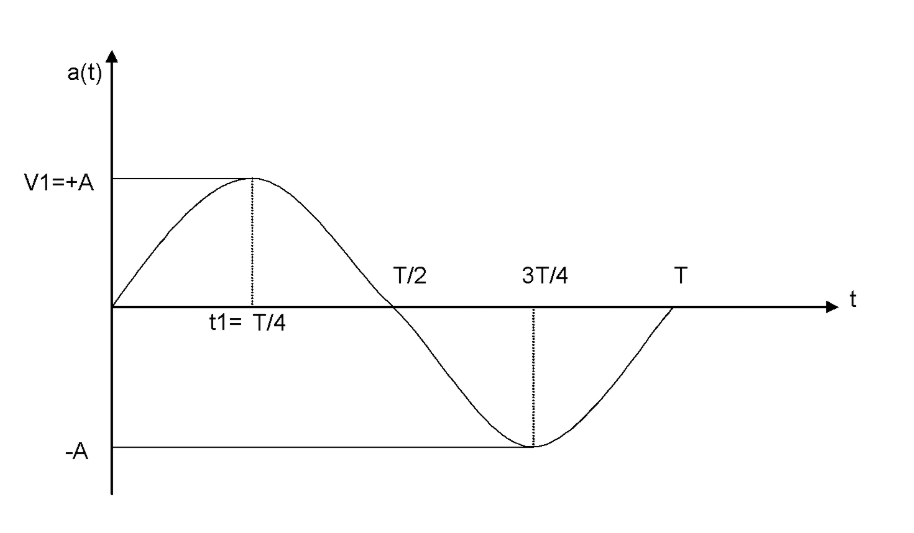
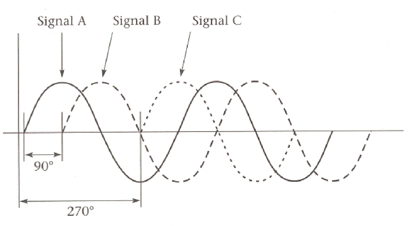

# Chapter 2: Analog Signals
- _Originally created 30 December, 2020 by Maxwell Hauser — Updated 5 October, 2025_
- _Builds upon Chapter 1: Introduction to Signals and Number Systems._

---

## Definitions

A signal is a function that conveys information about a phenomenon. Signals can be classified into two main types: **analog** and **digital**.

### Analog Signals

An analog signal is a signal whose amplitude is a function of time and changes gradually as time changes. Analog signals can be classified as **periodic** and **non-periodic** signals.

#### Periodic Analog Signals

A signal that repeats a pattern within a measurable time period is called a **periodic signal**.

- The completion of a full pattern is called a **cycle**.
- The simplest periodic signal is a **sine wave**.
- In the time domain, sine wave amplitude can be represented mathematically, where $A$ is the maximum amplitude, $\omega$ is the angular frequency, and $\phi$ is the phase angle.

Periodic signals can be further classified into two types:
- **Continuous signals:** Defined for every instant of time and can take on any value within a given range.
- **Discrete signals:** Defined only at specific intervals and can take on a limited number of values.

**Examples of periodic signals:**
- Sine waves
- Square waves
- Sawtooth waves

**Period (T):** The time it takes for one complete cycle of the signal to occur, measured in seconds (s).

**Example of a periodic analog signal:**
> 

- A periodic signal can also be represented in the frequency domain where the horizontal axis is the frequency and the vertical axis is the amplitude of the signal.

- The figure below shows the frequency domain representation of a sine wave signal:
    > 

---

#### Non-Periodic Analog Signals

A non-periodic signal is a signal that does not repeat itself over time. It can be random in nature and can take on any value within a given range.

**Examples of non-periodic signals:**
- Speech signals
- Music signals
- Environmental noise

A non-periodic signal can be represented as a continuous function of time.

**Example of a non-periodic analog signal:**
> 

---

#### Characteristics of Analog Signals

Usually, an electrical signal representing voice, temperature, or a musical sound is made of multiple waveforms. These signals have one **fundamental frequency** and multiple frequencies that are called **harmonics**. The fundamental frequency is the lowest frequency of a periodic waveform, and the harmonics are integer multiples of the fundamental frequency.

The characteristics of a periodic analog signal are **frequency**, **amplitude**, and **phase**.

**1. Frequency (F):**

The number of cycles in one second, represented in Hertz (Hz). If each cycle of an analog signal is repeated every one second, the frequency of the signal is 1 Hz. If each cycle is repeated 1000 times every second (once every millisecond), the frequency is 1000 Hz.

**2. Amplitude (A):**

The maximum value of the signal, representing the strength or intensity of the signal. The amplitude of an analog signal is a function of time as shown in the below figure and may be represented in volts (unit of voltage). In other words, the amplitude is its voltage value at any given time.

> 

A sine wave signal over one period (T) is shown above. The amplitude of the signal varies with time. The maximum amplitude of the signal is A, and the minimum amplitude is -A.

**3. Phase (φ):**

The position of the waveform relative to a reference point in time, usually measured in degrees. Two signals with the same frequency can differ in phase. This means that one of the signals starts at a different time from the other one. This difference can be represented by degrees, from 0 to 360 degrees or by radians. A phase angle of zero means the sine wave starts at time zero and a phase angle of 90 degrees means the signal starts at 90 degrees as shown in the figure below.

> 

The three sine wave signals above have the same frequency and amplitude but differ in phase.

---

### Frequency and Period Tables

**Frequency Units:**

| Unit of Frequency | Numerical Value |
|-------------------|----------------|
| Hertz (Hz)        | 1              |
| Kilo Hertz (kHz)  | $10^3$         |
| Mega Hertz (MHz)  | $10^6$         |
| Giga Hertz (GHz)  | $10^9$         |
| Tera Hertz (THz)  | $10^{12}$      |

**Period Units:**

| Unit of Period    | Numerical Value |
|-------------------|----------------|
| Second (s)        | 1 s            |
| Millisecond (ms)  | $10^{-3}$ s    |
| Microsecond (μs)  | $10^{-6}$ s    |
| Nanosecond (ns)   | $10^{-9}$ s    |
| Picosecond (ps)   | $10^{-12}$ s   |

---

## Example Problem

**Problem:** Find the equation for a sine wave signal with a frequency of 10 Hz, maximum amplitude of 20 volts, and phase angle of zero.

**Solution:**

The general equation for a sine wave signal is given by:

$$V(t) = A \cdot \sin(2\pi F t + \phi)$$

Where:
- $V(t)$ is the instantaneous voltage at time $t$
- $A$ is the amplitude
- $F$ is the frequency
- $\phi$ is the phase angle

Substituting the given values into the equation:

- Amplitude $A = 20$ volts
- Frequency $F = 10$ Hz
- Phase angle $\phi = 0$

The equation becomes:

$$V(t) = 20 \cdot \sin(2\pi \cdot 10 \cdot t + 0)$$

Simplifying further:

$$V(t) = 20 \sin(20\pi t)$$

This is the equation for the sine wave signal with the specified parameters.
